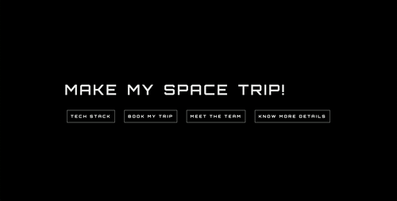
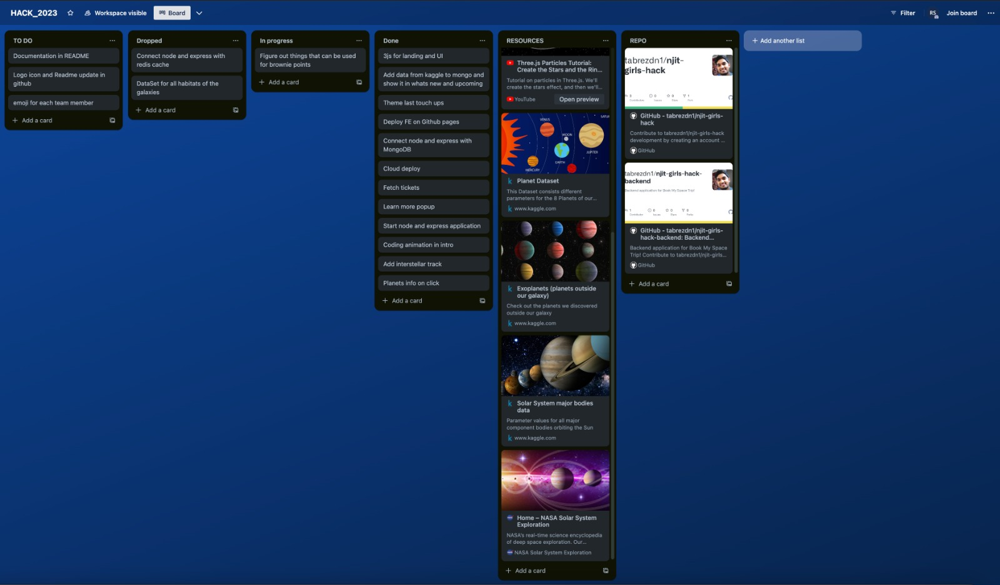

  

<h1  align="center">Make My Space Trip</h1>

  

###

  

<h3  align="center"><a  href="https://tabrez-njit.github.io/">Try it out!</a></h3>

  

###

  

Made with Web GL, Three js, Vue js

  ### Product Brief:
In a world where the wonders of artificial intelligence and machine learning have become commonplace, there still exists a group of visionaries who believes in the future of web.

The young minds on Earth have been searching and scouring the depths of space with the yearn to colonize. In order to begin this voyage, the space enthusiasts have to overcome numerous hurdles and difficulties. WE ARE HERE, to make those obstacles a tad bit easier to overcome and the voyage a ton more fun.

Web development has entered a new dimension with technologies like Web GL,Three.js which enables the GPU rendering directly in the browser. Further, leveraging datasets related to space exploration, habitability, planets and so on, enabled US TO CRAFT captivating web applications along with inventory and trip management, that transports users to the far reaches of the cosmos.

### Tech Stack:
- Front End - Web GL based library - Three js, Vue js + vite
- Back End - Node js, Express js
- Database - Mongo DB
- Cloud - Google Cloud Platform, Github Pages

### Deployed Apps:
Front End - https://tabrez-njit.github.io/
Back End - https://total-treat-400007.uk.r.appspot.com/

### Meet the Team:
- Shaik Tabrez 

- Ankush Ranapure 

- Richa Singh 

### Roadmap to Development for Hackathon:

### How does it work?

- Move around the Solar system with mouse

- Click on planet or moon to find out more about it

- Change the speed with side menu

  

### How to install

- Clone repository to your local machine

- Open terminal and cd into repository folder

- run npm install

- run npm run dev